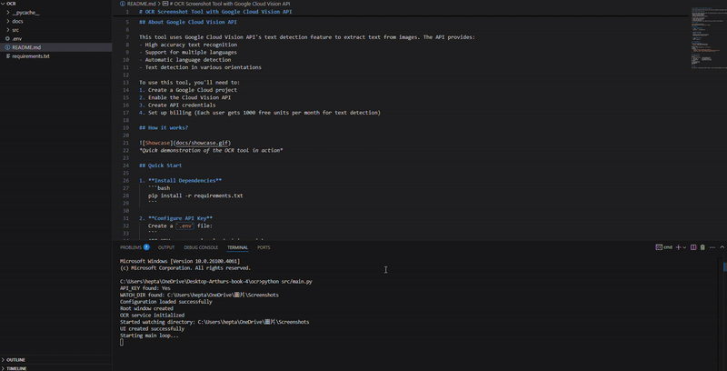

# OCR Screenshot Tool with Google Cloud Vision API

A simple Python application that extracts text from your screenshots using Google Cloud Vision API. You can copy, edit the results and send them to Google or other webs.


## How it works?


*Quick demonstration of the OCR tool in action*

## Quick Start

1. **Install Dependencies**
   ```bash
   pip install -r requirements.txt
   ```

2. **Configure API Key**
   Create a `.env` file:
   ```
   API_KEY=your_google_cloud_vision_api_key
   WATCH_DIR=path_to_screenshots_folder
   ```

3. **Launch Application**
   ```bash
   python src/main.py
   ```

## 🛠️ Configuration

### Environment Variables
- `API_KEY`: Google Cloud Vision API key
- `WATCH_DIR`: Screenshot directory path

### Web Presets
Configure custom web presets in `src/config.py`:
```python
web_presets = {
    "Google": "https://www.google.com/search?q=",
    "Wikipedia": "https://en.wikipedia.org/wiki/Special:Search?search=",
    "Google Translate": "https://translate.google.com/?text="
}
```

## Project Structure
```
ocr-screenshot-tool/
├── src/
│   ├── ocr_service.py    # OCR processing logic
│   ├── ui.py            # GUI implementation
│   ├── config.py        # Configuration settings
│   └── main.py          # Application entry point
├── docs/
│   └── showcase.gif
├── requirements.txt
├── README.md
└── .env
```

## License

This project is licensed under the MIT License - see the [LICENSE](LICENSE) file for details.

## Acknowledgments

Some parts of this project were generated with the help of AI tools.
